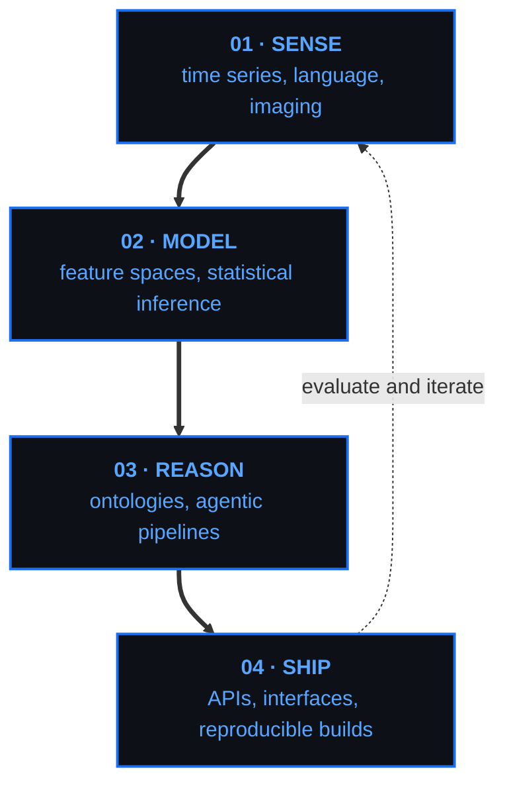

<div align="center">


<h1>Stijn Van Severen</h1>


<br/>

<a href="https://stvsever.github.io/my_resume/">
  
</a>
<a href="https://orcid.org/0009-0003-9181-966X">
  
</a>

</div>

---

```console
stijn@ugent:~$ ./whoami --verbose

  role       :: AI engineer, computational researcher
  focus      :: agentic systems, behavioral modeling, applied ML
  substrate  :: humans, time series, language, brains
  method     :: reproducible by default, containerized, versioned
  status     :: [ ONLINE ] compiling ideas into systems
```

---

## How I build



---

## Capabilities

| Layer | What it means |
| :--- | :--- |
| `reasoning` | Multi-agent architectures, ontology-driven pipelines, LLM evaluation and interpretability |
| `modeling` | Time-series and person-specific analytics, multimodal features, statistical inference |
| `systems` | Full-stack applications, APIs, containerized infrastructure, automated reporting |
| `science` | Study design, replication-grade codebases, literature-scale extraction, publication pipelines |

---

## Stack

| | |
| :--- | :--- |
| **Languages** |       |
| **ML and data** |      |
| **Infrastructure** |      |

---

<div align="center">


</div>

---

<div align="center">

`01000100 01101111 00100000 01101110 01101111 01110100 00100000 01100100 01101001 01110011 01110100 01110101 01110010 01100010 00100000 01101101 01100101 00101100 00100000 01001001 00100111 01101101 00100000 01101101 01100001 01111000 01101001 01101101 01101001 01111010 01101001 01101110 01100111 00100000 01101101 01111001 00100000 01100001 01100111 01100101 01101110 01100011 01111001 00101110`

</div>
